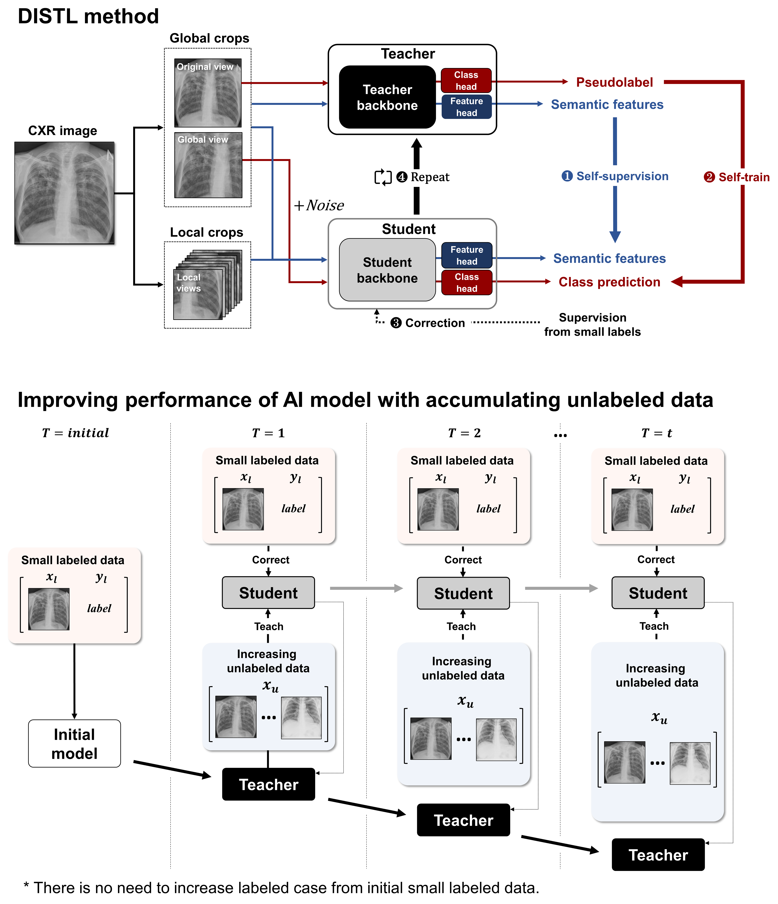
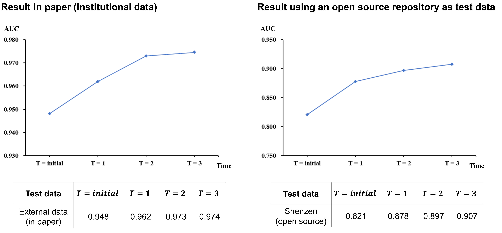

[](https://zenodo.org/badge/latestdoi/457379287)

## : Code for "Self-evolving vision transformer for chest X-ray diagnosis through knowledge distillation"
### DISTL: Distillation for self-supervised and self-train learning

<div align="center">
  
</div>

### [Paper] | [Official Pytorch code](https://github.com/sangjoon-park/AI-Can-Self-Evolve)


> **DISTL: Distillation for self-supervised and self-train learning**<br>
>
> *DISTL is a deep learning algorithm developed to gradually improve the performance of AI model with the accumulating data every year without any annotation by experts. For demo, we provide python codes where you can train, evaluate and visualize the attention of the model.*

## System requirements
### General requirements
#### OS
* Ubuntu 20.04

#### Software
* Python 3.8 (tested on)
* Conda
* Pytorch 1.8.0 (tested on)
* CUDA version 11.1 (tested on)

#### Hardware
* CPU or GPU that supports CUDA CuDNN and Pytorch 1.8.
* We tested on GeFore RTX 3090.
* We recommend RAM of more than 32 GB.

## Installation guide
### Instruction
* Install Pytorch and other dependencies. It can be easily installed with requirements.txt file.
```
>  pip install -r requirements.txt
```

## Data preparation
### Downloading data

The open-source datasets used in paper can be obtained from following links.

#### Normal and Tuberculosis CXRs
* CheXpert data (https://stanfordmlgroup.github.io/competitions/chexpert/)
* India tuberculosis repository (https://www.kaggle.com/raddar/chest-xrays-tuberculosis-from-india)
* Montgomery County tuberculosis data (https://www.kaggle.com/raddar/tuberculosis-chest-xrays-montgomery)
* Shenzen tuberculosis data (https://www.kaggle.com/raddar/tuberculosis-chest-xrays-shenzhen)
* Belarus tuberculosis data (https://github.com/frapa/tbcnn/tree/master/belarus)
* PADChest repository (https://github.com/auriml/Rx-thorax-automatic-captioning)
* TBX 11k repository (https://www.kaggle.com/usmanshams/tbx-11)
* NIH normal data (https://cloud.google.com/healthcare-api/docs/resources/public-datasets/nih-chest)
* NIH tuberculosis data (https://tbportals.niaid.nih.gov/download-data)

#### Pneumothorax CXRs
* SIIM-ACR Pneumohtorax Segmentation data (https://www.kaggle.com/c/siim-acr-pneumothorax-segmentation)

#### COVID-19 CXRs
* BIMCV repository (https://github.com/BIMCV-CSUSP/BIMCV-COVID-19)
* Brixia COVID-19 data (https://brixia.github.io/)

From these datasets, we only used normal, tuberculosis, pneumothorax and COVID-19 CXRs.

Other parts of the institutional data (AMC, CNUH, YNU, KNUH) used in this study cannot be shared without the signed agreement as they may contain private information.
However, we found that similar results can be obtained when using an open-source repository for validation and the others for the model development. 

<div align="center">
  
</div>

For instance, you can use Shenzen tuberculosis data containing 327 normal and 335 tuberculosis CXRs as test data as above.

### Data preprocessing
After downloading all data, dicom (.dcm) files should first be converted to image (.png) files.
```
>  python dcm_to_npy.py --dir PATH/DCM/ --save_dir PATH/SAVE/
```
Then, locate all normal data into a folder name containing *Normal* and all tuberculosis data into a folder name containing *Tuberculosis*.

Next, locate all training data to a folder and test data to another folder, and execute data splitter. It automatically split training data into small labeled subsets (10%) and 3 folded unlabeled subsets, and save test data in another folder.
```
>  python data_splitter.py --train_folder PATH/TRAIN/ --test_folder PATH/TEST/ --save_dir PATH/SAVE/
```

After successful preprocessing, your data will be located as below.

```
--- save_dir
     --- labeled (containing about 10% of training data)
            --- xxx.png
            --- ...
     --- fold_0 (unlabeled fold containing about 30% of training data)
            --- xxx.png
            --- ...
     --- fold_1 (unlabeled fold containing about 30% of training data)
            --- xxx.png
            --- ...
     --- fold_2 (unlabeled fold containing about 30% of training data)
            --- xxx.png
            --- ...
     --- test (containing validation data)
            --- xxx.png
            --- ...
```

## Download pretrained weights
You can download the pretrained weights on the CheXpert dataset in link below, which should be located as,

https://drive.google.com/file/d/16y3eJRYQCg-B8rg9eB3XRA-6PcfHCNmA/view?usp=sharing

```
./pretrained_weights/pretrain.ckpt
```

## Training a model
The pretrained Vision transformer (ViT-S8) weight is provided in *./pretrained_weights* folder.

First, train the initial model with small initial labeled data.
```
> python pratrain.py --name LABELED --pretrained_dir ./pretrained_weights/pretrain.ckpt --data_path /PATH/DATA/ --output_dir /PATH/LABELED/
```
Then, iteratively improve the model with the proposed DISTL, increasing the size of unlabeled data.

Note that the resulting weight after training of this iteration is used as the starting point at next iteration.
```
# Iteration 1
> python main_run.py --name FOLD1 --pretrained_dir /PATH/LABELED/checkpoint.pth --data_path /PATH/DATA/ --output_dir /PATH/FOLD1/ --total_folds 1

# Iteration 2
> python main_run.py --name FOLD2 --pretrained_dir /PATH/FOLD1/checkpoint.pth --data_path /PATH/DATA/ --output_dir /PATH/FOLD2/ --total_folds 2

# Iteration 3
> python main_run.py --name FOLD3 --pretrained_dir /PATH/FOLD2/checkpoint.pth --data_path /PATH/DATA/ --output_dir /PATH/FOLD3/ --total_folds 3
```
## Evaluating a model
You can evaluate the model performance (AUC) with the following code.
```
> python eval_finetune.py --name EXP_NAME --pretrained_dir /PATH/FOLD3/checkpoint.pth --data_path /PATH/DATA/ --checkpoint_key student
```

## Visualizing attention
The attentions of Vision transformer model can be visualized with following code.
```
> python visualize_attention.py --pretrained_weights /PATH/FOLD3/checkpint.pth --image_dir /PATH/DATA/ --checkpoint_key student
```
Successful visualization will provide attention maps as below.

<div align="center">
  
</div>


#### If you have any questions, please contact us via:
depecher@kaist.ac.kr

