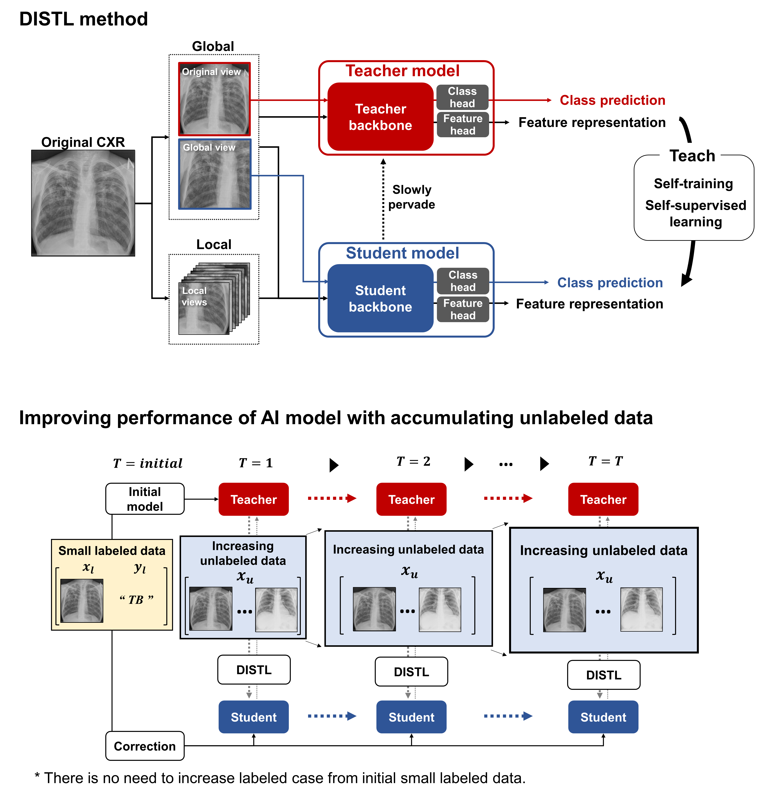

## : Code implementation for "AI can evolve without labels"
### DISTL: Distillation for self-supervised and self-train learning

<div align="center">
  
</div>

### [Paper] | [Official Pytorch code](https://github.com/sangjoon-park/AI-Can-Self-Evolve)


> **DISTL: Distillation for self-supervised and self-train learning**<br>
>
> *DISTL is a deep learning algorithm developed to gradually improve the performance of AI model with the accumulating data every year without any annotation by experts. For demo, we provide python codes where you can train, evaluate and visualize the attention of the model.*

## System requirements
### General requirements
#### OS
* Ubuntu 20.04

#### Software
* Python 3.8 (tested on)
* Conda
* Pytorch 1.8.0 (tested on)
* CUDA version 11.1 (tested on)

#### Hardware
* CPU or GPU that supports CUDA CuDNN and Pytorch 1.8.
* We tested on GeFore RTX 3090.
* We recommend RAM of more than 32 GB.

## Data preparation
The open-source datasets used in paper can be obtained from following links.

#### Normal and Tuberculosis CXRs
* CheXpert data (https://stanfordmlgroup.github.io/competitions/chexpert/)
* India tuberculosis repository (https://www.kaggle.com/raddar/chest-xrays-tuberculosis-from-india)
* Montgomery County tuberculosis data (https://www.kaggle.com/raddar/tuberculosis-chest-xrays-montgomery)
* Shenzen tuberculosis data (https://www.kaggle.com/raddar/tuberculosis-chest-xrays-shenzhen)
* Belarus tuberculosis data (https://github.com/frapa/tbcnn/tree/master/belarus)
* PADChest repository (https://github.com/auriml/Rx-thorax-automatic-captioning)
* TBX 11k repository (https://www.kaggle.com/usmanshams/tbx-11)
* NIH normal data (https://cloud.google.com/healthcare-api/docs/resources/public-datasets/nih-chest)
* NIH tuberculosis data (https://tbportals.niaid.nih.gov/download-data)

#### Pneumothorax CXRs
* SIIM-ACR Pneumohtorax Segmentation data (https://www.kaggle.com/c/siim-acr-pneumothorax-segmentation)

#### COVID-19 CXRs
* BIMCV repository (https://github.com/BIMCV-CSUSP/BIMCV-COVID-19)
* Brixia COVID-19 data (https://brixia.github.io/)

From these datasets, we only used normal, tuberculosis, pneumothorax and COVID-19 CXRs.

Other parts of the institutional data (AMC, CNUH, YNU, KNUH) used in this study cannot be shared without the signed agreement as they may contain private information.
However, we found that 

```
├── dataset
   └── YOUR_DATASET_NAME
       ├── trainA
           ├── xxx.jpg (name, format doesn't matter)
           ├── yyy.png
           └── ...
       ├── trainB
           ├── zzz.jpg
           ├── www.png
           └── ...
       ├── testA
           ├── aaa.jpg 
           ├── bbb.png
           └── ...
       └── testB
           ├── ccc.jpg 
           ├── ddd.png
           └── ...
```

### Train
```
> python main.py --dataset selfie2anime
```
* If the memory of gpu is **not sufficient**, set `--light` to True

### Test
```
> python main.py --dataset selfie2anime --phase test
```

## Architecture
<div align="center">
  
</div>

---

<div align="center">
  
</div>

## Results
### Ablation study
<div align="center">
  
</div>

### User study
<div align="center">
  
</div>

### Comparison
<div align="center">
  
</div>
